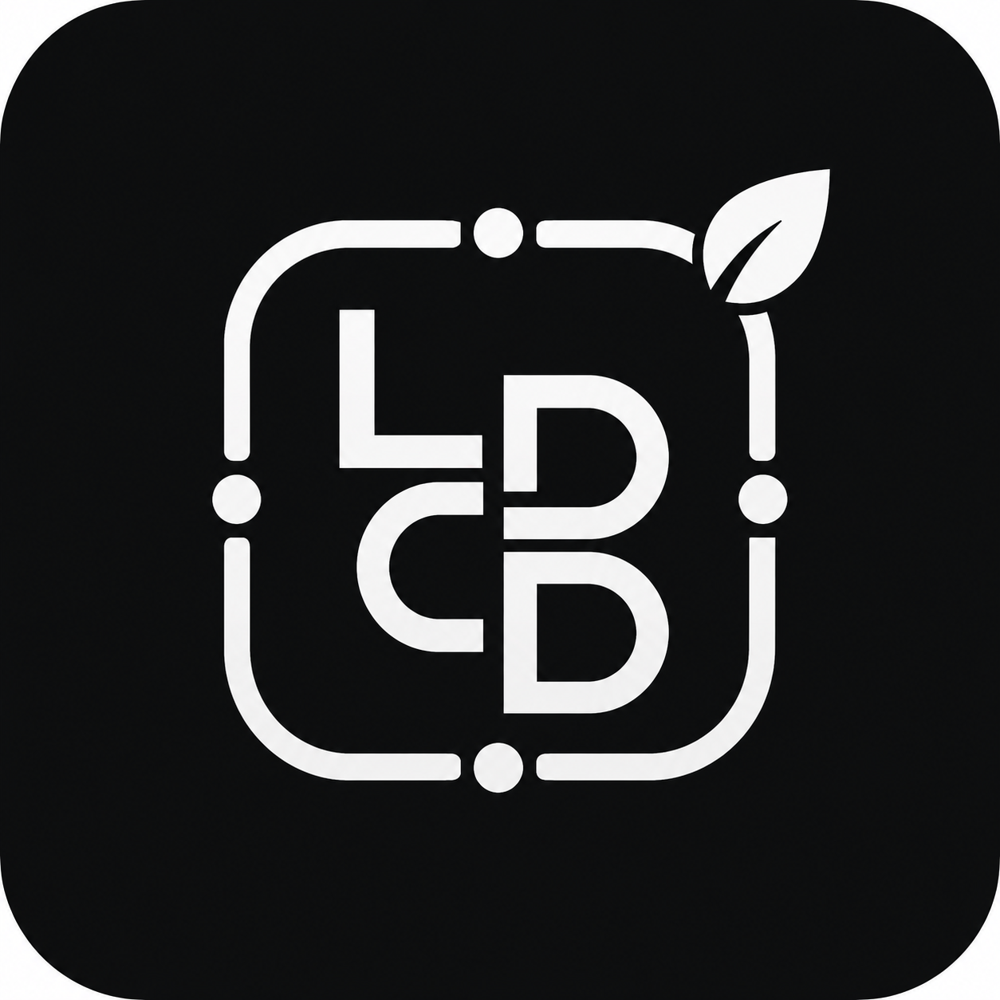

<div align="center">
    
    <h1>Living Context Driven Development</h1>
    <h3><em>Discover. Govern. Enforce. Observe.</em></h3>
</div>

<p align="center">
    <strong>An open specification and methodology for discovering, managing, and enforcing the constraints that govern AI-assisted software development — across any source, any tool, any stack.</strong>
</p>

<p align="center">
    <a href="https://github.com/Lelianto/living-context-driven-development/releases"></a>
    <a href="https://github.com/Lelianto/living-context-driven-development/stargazers"></a>
    <a href="LICENSE"></a>
    <a href="https://livingcontext.dev"></a>
</p>

<p align="center">
    <strong>English</strong>
</p>

---

## Table of Contents

- [■ What is Living Context Driven Development?](#-what-is-living-context-driven-development)
- [▶ The Problem](#-the-problem)
- [◈ The LCDD Way](#-the-lcdd-way)
- [◆ The Context — First-Class Governance Artifact](#-the-context--first-class-governance-artifact)
- [↻ The Context Lifecycle](#-the-context-lifecycle)
- [→ The Discovery Pipeline](#-the-discovery-pipeline)
- [◉ Governance by Rate of Change](#-governance-by-rate-of-change)
- [☰ Quick Start — Reading the Specification](#-quick-start--reading-the-specification)
- [⊞ Repository Map](#-repository-map)
- [⇔ Comparison with Related Approaches](#-comparison-with-related-approaches)
- [※ Core Philosophy](#-core-philosophy)
- [☗ Roadmap](#-roadmap)
- [✎ Contributing](#-contributing)
- [▤ Learn More](#-learn-more)
- [✉ Support](#-support)
- [♥ Acknowledgements](#-acknowledgements)
- [⚖ License](#-license)

---

## ■ What is Living Context Driven Development?

Living Context Driven Development (LCDD) is a **methodology and open specification** for governing software behavior in the age of AI-assisted development. It answers three questions that no existing methodology fully addresses:

| Question | LCDD's Answer |
|---|---|
| **How do I discover** what rules my software should follow? | The **Context Engineering Pipeline** — nine stages from source detection to continuous improvement, ingesting regulations, standards, team decisions, incident postmortems, and AI suggestions from any format. |
| **How do I manage** constraints as they evolve? | The **Context Lifecycle** — six explicit stages (Draft → Candidate → Approved → Active → Deprecated → Archived), each with defined enforcement behavior, review requirements, and observability expectations. |
| **How do I ensure** AI agents respect constraints? | **Specification Drift Prevention** — AI agents cannot modify Hardened contexts. Every violation is attributed to human or AI actor. Violation patterns trigger governance review. |

> **Analogy:** If TDD governs *how* you test, and DDD governs *how* you model, then LCDD governs *what rules* constrain everything you build — and ensures those rules are discovered, not assumed.

---

## ▶ The Problem

AI-assisted development has made code generation fast. But it has introduced **three new failure modes** that existing methodologies were not designed to address:

### 1. Specification Drift

When an AI agent faces a failing test, it sometimes **fixes the test instead of the code** — rewriting what "correct" means rather than fixing what's broken. The agent optimizes for "all tests pass" by modifying the specification itself.

### 2. Discovery Deficit

A startup founder doesn't know which government regulations apply to their fintech product. A team's architectural decisions live in a 6-month-old Slack thread remembered by one person. A security requirement in a PDF is never checked against actual code. **The rules are scattered, invisible, and unenforced.**

### 3. Governance Asymmetry

A PCI-DSS requirement and a preference for tabs over spaces are both "rules" — but they go through the same PR process. Critical constraints don't get the scrutiny they deserve, and trivial preferences get more process than they need.

```
             Discovery Deficit              Specification Drift
             ────────────────              ───────────────────
    "I don't know what rules        "The AI changed the test to match
     I should be following."         the broken code I wrote."

                    └────────┬───────┘
                             │
                    ┌────────▼───────┐
                    │     LCDD       │
                    │  closes both   │
                    │     gaps       │
                    └────────────────┘
```

---

## ◈ The LCDD Way

### The Four Values

| Value | What It Means |
|---|---|
| **Context Discovery** over Constraint Enforcement | Finding what rules to follow matters more than perfectly enforcing rules you already know. |
| **Living Evolution** over Static Specification | Contexts that evolve with the system. Tested daily, not read once and forgotten. |
| **Explicit Governance** over Implicit Trust | Every context answers: who says this is a rule, why, and who can change it? |
| **Machine-Readable Context** over Human-Only Documentation | If an AI agent cannot consume it, it will be ignored at scale. |

### The Twelve Principles

1. **Context is a first-class artifact** — versioned, structured, machine-readable.
2. **Contexts are discovered, not assumed** — continuous discovery from any source.
3. **Every context has provenance** — who says this is a rule, and why trust them?
4. **Contexts have a lifecycle** — Draft → Candidate → Approved → Active → Deprecated → Archived.
5. **Governance matches rate of change** — Hardened for regulations, Local for preferences.
6. **Sources are heterogeneous — the model is unified** — one schema for all constraint origins.
7. **AI agents consume and respect contexts** — injected as structured constraints, not vague prompts.
8. **Enforcement is pluggable** — CI, IDE, API gateway, pre-commit; the *what* is LCDD, the *where* is plugins.
9. **Observability closes the feedback loop** — violations tracked, trends analyzed, contexts improved.
10. **Conflicting contexts must be resolved, not hidden** — surfaced explicitly for human judgment.
11. **Contexts are composable** — Context Packs enable sharing across teams and community.
12. **The methodology applies to itself** — LCDD is governed using LCDD principles.

> Read the full [Manifesto](manifesto/manifesto.md) and [First Principles](manifesto/first-principles.md).

---

## ◆ The Context — First-Class Governance Artifact

The **Context** is the atomic unit of governance in LCDD. It is not a comment, not a ticket, not a Slack message. It is a **structured, versioned, machine-readable artifact** with:

```yaml
id: "ctx-api-input-validation"
version: 1
title: "All API endpoints MUST validate input against an OpenAPI schema"
description: >
  Every API endpoint must have a corresponding OpenAPI 3.x schema.
  Request validation MUST be performed at the API gateway layer.

source:                           # Where did this come from?
  type: "organization"
  uri: "https://wiki.example.com/security/api-standards"

authority:                        # Who says this is a rule, and why trust them?
  source: { type: "organization", id: "ciso-office", name: "CISO Office" }
  level: 3                        # 0=Suggestion … 4=Mandate

lifecycle: "active"               # Draft → Candidate → Approved → Active → Deprecated → Archived

governance:                       # How hard is it to change this?
  classification: "hardened-standard"   # AI agents CANNOT modify hardened contexts
  approval_required: true

enforcement:                      # How is this enforced?
  mode: "block"                   # Block merge, warn, comment, or silent
  specification:
    type: "openapi-validation"    # Pluggable enforcement mechanism

evidence:                         # Why does this rule exist?
  - type: "security-incident"
    uri: "https://incidents.example.com/INC-2025-087"
    description: "SQL injection via unvalidated API input"
```

Each Context is a **self-contained governance unit** — it knows its source, its authority, its lifecycle stage, and how it should be enforced. See the full [Context Schema](specification/0012-context-schema.md).

---

## ↻ The Context Lifecycle

Constraints don't jump from "someone mentioned this" to "this blocks production." They move through six explicit stages:

```
Draft ──→ Candidate ──→ Approved ──→ Active ──→ Deprecated ──→ Archived
  │           │             │            │            │              │
  │  "Someone │  "Under     │  "Approved │  "This     │  "No longer │  "Retained
  │   mention-│   review"   │   but not  │   blocks   │   applies"  │   for audit"
  │   ed this"│             │   yet      │   merges"  │             │
  │           │             │   active"  │            │             │
  │  No       │  Comment    │  Warn      │  Block /   │  Warn with  │  No
  │  enforce- │  only       │  mode      │  Warn      │  deprecation│  enforcement
  │  ment     │             │            │            │  notice     │
```

Each transition is an auditable event. Contexts can be reactivated if conditions change. Emergency shortcuts exist but require post-hoc review. See the full [Context Lifecycle](specification/0002-context-lifecycle.md).

---

## → The Discovery Pipeline

The LCDD Context Engineering Pipeline is what makes LCDD different from every other approach — it starts from **unknown constraints**, not known ones:

```
Discover ──→ Extract ──→ Normalize ──→ Classify ──→ Review ──→ Version ──→ Enforce ──→ Observe ──→ Improve
    │            │            │             │            │           │           │            │            │
    │ Monitor    │ LLM-parses │ Maps to     │ Assigns    │ Human or  │ Commits   │ CI, IDE,   │ Metrics,   │ Refine,
    │ OJK PDFs,  │ regulations│ Context     │ authority, │ automated │ immutable │ AI agent,  │ dashboards,│ deprecate,
    │ Slack,     │ from       │ Schema      │ lifecycle, │ review    │ version   │ gateway    │ alerts     │ or create
    │ GitHub,    │ 200-page   │             │ severity   │           │           │            │            │
    │ etc.       │ documents  │             │            │           │           │            │            │
```

**Example:** A new OJK regulation is published → Discover detects it → Extract parses it with an LLM → Normalize maps it to the Context Schema → Classify assigns it level 4 (Mandate) → Review routes it to the compliance team → Version commits it as Draft → Approve → Active → Block enforcement in CI. See the full [Context Builder](specification/0006-context-builder.md).

---

## ◉ Governance by Rate of Change

Directly inspired by AI Harness (Bunardzic, 2025), LCDD classifies every Context by how fast it should change:

| Classification | Authority | Change Speed | AI Can Modify? | Default Enforcement | Example |
|---|---|---|---|---|---|
| **Hardened-Mandate** | 4 (Mandate) | Very slow | ❌ Never | Block | OJK regulation, PCI-DSS |
| **Hardened-Standard** | 3 (Standard) | Slow | ❌ Never | Block | CISO security policy |
| **Hardened-Local** | 2 (Guideline) | Moderate | ❌ (can suggest) | Warn | Team architecture decision |
| **Local-Standard** | 2 (Guideline) | Moderate | ✅ With review | Warn | Recommended libraries |
| **Local-Guideline** | 1 (Preference) | Fast | ✅ Auto-merge | Comment | Code style conventions |
| **Local-Experimental** | 0 (Suggestion) | Very fast | ✅ Primary source | Silent | AI-generated suggestions |

Hardened contexts require formal RFC + explicit human approval. Local contexts can evolve through AI suggestion and fitness-based optimization. See the full [Governance Model](specification/0004-governance.md).

---

## ☰ Quick Start — Reading the Specification

LCDD is currently in **Specification Phase (v0.1.0)**. There is no reference CLI yet — the methodology is being defined and refined.

### For Readers (30 minutes)

1. [Manifesto](manifesto/manifesto.md) — the four values and twelve principles.
2. [Problem Statement](specification/0000-problem.md) — the seven sub-problems LCDD solves.
3. [Core Principles](specification/0001-core-principles.md) — ten normative principles.
4. [Glossary](docs/glossary.md) — canonical vocabulary.
5. [Introduction](docs/introduction.md) — gentle conceptual overview.

### For Implementers (2–3 hours)

1. [Context Lifecycle](specification/0002-context-lifecycle.md)
2. [Context Schema](specification/0012-context-schema.md)
3. [Context Registry](specification/0005-context-registry.md)
4. [Context Protocol](specification/0013-context-protocol.md)
5. [Reference Architecture](specification/0015-reference-architecture.md)

### For Teams Adopting LCDD

1. [Adoption Guide](docs/adoption.md) — six-level adoption path, from awareness to full platform.
2. [Comparison](docs/comparison.md) — how LCDD relates to TDD, DDD, SDD, CDD tools, and more.
3. [FAQ](docs/faq.md) — common questions with concrete answers.
4. [Examples](examples/) — five domain Context Packs (Startup, Fintech/OJK, Healthcare/HIPAA, E-commerce, Hackathon).

---

## ⊞ Repository Map

```
living-context-driven-development/
│
├── 📜 README.md                         # You are here
├── 📜 LICENSE                           # Apache 2.0
├── 📜 GOVERNANCE.md                     # How this project is governed
├── 📜 ROADMAP.md                        # Six-milestone roadmap
├── 📜 CHANGELOG.md                      # Version history
├── 📜 CONTRIBUTING.md                   # How to contribute
├── 📜 CODE_OF_CONDUCT.md                # Contributor Covenant
├── 📜 SECURITY.md                       # Security policy
├── 📜 SUPPORT.md                        # Support guidelines
├── 📜 AGENTS.md                         # Instructions for AI agents
├── 📜 CITATION.cff                      # Academic citation
│
├── 📂 manifesto/                        # The LCDD Manifesto
│   ├── manifesto.md                     # Four Values + Twelve Principles
│   ├── first-principles.md              # Five Axioms of LCDD
│   └── vision.md                        # Long-term vision (5 phases)
│
├── 📂 specification/                    # Core Specification (RFC-style)
│   ├── 0000-problem.md                  # Problem Statement
│   ├── 0001-core-principles.md          # Core Principles
│   ├── 0002-context-lifecycle.md        # Context Lifecycle
│   ├── 0003-authority-model.md          # Authority Model
│   ├── 0004-governance.md               # Governance Model
│   ├── 0005-context-registry.md         # Context Registry
│   ├── 0006-context-builder.md          # Context Engineering Pipeline
│   ├── 0007-context-engineering.md      # Context Engineering Patterns
│   ├── 0008-verification.md             # Verification
│   ├── 0009-observability.md            # Observability
│   ├── 0010-ai-agents.md                # AI Agent Governance
│   ├── 0011-context-query-language.md   # CQL Specification
│   ├── 0012-context-schema.md           # Context Schema
│   ├── 0013-context-protocol.md         # Context Protocol
│   ├── 0014-security.md                 # Security Model
│   ├── 0015-reference-architecture.md   # Reference Architecture
│   └── 0016-roadmap.md                  # Detailed Roadmap
│
├── 📂 docs/                             # Companion Documentation
│   ├── research.md                      # Literature Review (v0.2.0)
│   ├── glossary.md                      # Canonical Vocabulary
│   ├── introduction.md                  # Gentle Introduction
│   ├── philosophy.md                    # Philosophical Foundations
│   ├── comparison.md                    # Comparison with Other Approaches
│   ├── adoption.md                      # Adoption Guide (6 levels)
│   └── faq.md                           # Frequently Asked Questions
│
├── 📂 reference/                        # Reference Artifacts
│   ├── schema/context-schema.json       # JSON Schema for Context
│   ├── yaml/example-context.yaml        # Example Context (YAML)
│   ├── json/example-context.json        # Example Context (JSON)
│   └── architecture/diagrams.md         # Architecture Diagrams
│
├── 📂 examples/                         # Example Context Packs
│   ├── startup/                         # Startup Best Practices
│   ├── fintech/                         # OJK Fintech Compliance
│   ├── healthcare/                      # HIPAA Compliance
│   ├── ecommerce/                       # E-commerce Best Practices
│   └── education/                       # Hackathon Competition Rubric
│
├── 📂 media/                            # Visual Identity
│   └── logo.svg                         # LCDD Logo
│
└── 📂 papers/                           # Future: Academic Papers
```

---

## ⇔ Comparison with Related Approaches

| | TDD | DDD | SDD | CDD Tools | GrayBeam CDD | AI Harness | Policy-as-Code | **LCDD** |
|---|---|---|---|---|---|---|---|---|
| **Governs** | Code behavior | Domain model | API contracts | AI workflow | Business rules | Arch. integrity | Infra policies | **All sources** |
| **Discovery** | ❌ | ❌ | ❌ | ❌ | ✅ (code only) | ❌ | ❌ | ✅ Pipeline |
| **Lifecycle** | ❌ | ❌ | ❌ | ❌ | ❌ | Binary | ❌ | ✅ Full (6-stage) |
| **AI-Aware** | ❌ | ❌ | ❌ | ✅ (workflow) | ⚠️ Planned | ✅ | ❌ | ✅ Built-in |
| **Source-Agnostic** | ❌ | ❌ | ❌ | ❌ | ❌ | ❌ | ❌ | ✅ |
| **Observability** | Test results | ❌ | ❌ | ❌ | ❌ | ❌ | Violations | ✅ Full |
| **Spec Drift Prevention** | ❌ | ❌ | ❌ | ❌ | ❌ | ✅ | ❌ | ✅ |
| **Community Sharing** | Test suites | ❌ | OpenAPI specs | ❌ | ❌ | ❌ | Rego libs | ✅ Context Packs |

**Key difference from CDD Tools (Conductor, PAW, Draft):** CDD tools manage AI agent *workflow* (Spec → Plan → Implement). LCDD manages AI agent *governance* (what rules must be obeyed). They are complementary — a team can use Conductor for process *and* LCDD for constraints simultaneously.

See the full [Comparison](docs/comparison.md) and [Literature Review](docs/research.md).

---

## ※ Core Philosophy

Living Context Driven Development is built on five axioms:

1. **All software is governed by constraints, whether acknowledged or not.** Making them visible is always better than leaving them implicit.
2. **In the age of AI-assisted development, constraint governance is the bottleneck, not code production.**
3. **Constraints exist on a spectrum of authority**, from individual preference to legal mandate. A unified methodology must accommodate the full spectrum.
4. **The sources of constraints are heterogeneous and evolving.** A methodology that cannot ingest from arbitrary sources is incomplete.
5. **Observability without enforcement is documentation; enforcement without observability is dogma.** The feedback loop makes a constraint *living*.

> Read the full [First Principles](manifesto/first-principles.md) and [Philosophy](docs/philosophy.md).

---

## ☗ Roadmap

| Milestone | Version | Status | Focus |
|---|---|---|---|
| **Foundation** | v0.1.0 | ✅ Complete | Specification — 17 docs, manifesto, examples, reference schema |
| **Reference CLI** | v0.2.0 | 🔴 Planned | `lcd init`, `lcd context`, `lcd validate`, `lcd query` |
| **MCP Server** | v0.3.0 | 🔴 Planned | AI agent integration, context injection, drift detection |
| **Ecosystem** | v0.5.0 | 🔴 Planned | VS Code, GitHub App, Community Packs, Dashboard |
| **Adoption** | v1.0.0 | 🔴 Planned | Stabilized spec, paper, conference talks, case studies |

See the full [Roadmap](specification/0016-roadmap.md) and [Vision](manifesto/vision.md).

---

## ✎ Contributing

LCDD is an open specification. Contributions of all kinds are welcome:

- **Critique** — open an issue challenging a principle or specification.
- **RFC** — propose a significant change following the RFC process.
- **Context Packs** — contribute domain-specific packs for your industry.
- **Documentation** — improve clarity, fix typos, add examples.

See [CONTRIBUTING.md](CONTRIBUTING.md) for the full process.

---

---

## ✉ Support

For questions, bug reports, or feature requests, please open a [GitHub issue](https://github.com/Lelianto/living-context-driven-development/issues/new). See [SUPPORT.md](SUPPORT.md) for support guidelines.

---

## ♥ Acknowledgements

LCDD builds on the foundational work of:

- **GrayBeam Technology** — Constraint-Driven Development
- **Alex Bunardzic** — AI Harness: Governing Change by Rate of Evolution
- **Google / Gemini CLI Extensions** — Conductor
- **Rob Emanuele** — Phased Agent Workflow (PAW)
- **Microsoft** — Agentic SDLC Starter
- **Eric Evans** — Domain-Driven Design
- **Kent Beck** — Test-Driven Development
- **Cyrille Martraire** — Living Documentation
- **Open Policy Agent** — Policy-as-Code

LCDD does not replace these works; it stands on their shoulders and addresses gaps they were not designed to fill.

---

## ⚖ License

Living Context Driven Development Specification is licensed under the Apache License 2.0. See [LICENSE](LICENSE).

---

<p align="center">
    <em>"We don't just use AI-assisted development. We practice Living Context Driven Development."</em>
</p>
